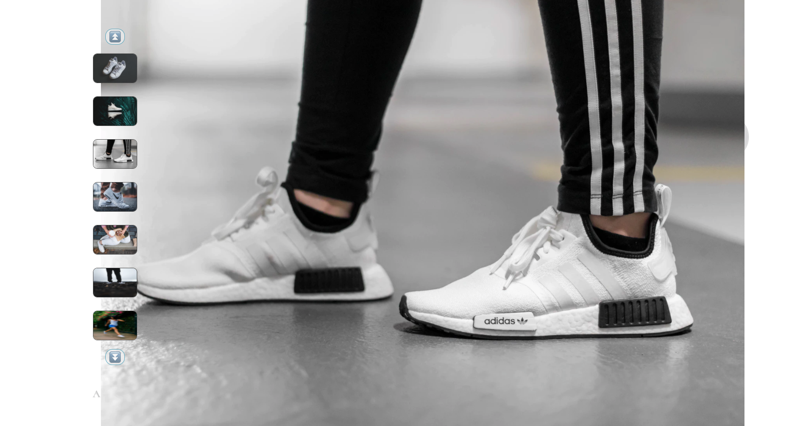

# Project Catwalk
Project Catwalk is a front-end e-commerce store front for online shoppers

## Table of Contents

1. [**Product Overview:**](#product-overview) View product with related images. Access or change style to see corresponding images and product name and product price. Includes add to cart and social media sharing features.

3. [**Ratings And Reviews:**](#ratings-and-reviews) A ratings and review widget to allow viewing and submission of reviews.

## Tech/framework used

**Built With**
- Javascript
- Node.js
- Express
- React
- Redux
- SASS

## Product Overview

1. ### Main image and Carousel
  * Thumbnail carousel holds up to seven images at a time
  * Zoom feature allows user to view enhanced image size
  * If selected style contains more then seven images, the carousel feature allows the user to move forward and backward to view remaining images
  * The carousel works such that it always shows seven images (or max number of images if less than seven)

2. Style selection
- Visually pleasing set of thumbnails for different available styles
- When different style selected:
  * Main image and image carousel update
  * Price, selected style, size availability update (if applicable)

3. Size and quantity dropdown
- Size dropown indicates available sizes for particular style
- Default quantity for dropdown is 15, but will update to number available if less than 15

4. Add to Bag, Add to Outfit
- Clickable icons that show item has been added

5. Social media share
- Clickable icon that renders pop-up to share product on social media (not intended to function)

6. Description and features
- Updates for selected product
- Style corresponds to related products pop-up modal

## Ratings And Reviews

The ratings and reviews widget allow users to view reviews before purchasing a product. The meta reviews on the left side allows to user to view averaged ratings past users have given and the right hand side allows users to see individual ratings. The widget also includes a write a review feature that allows the current user to write a review.

1. Product Breakdown and Review List
    * Implemented a sorting system
    * Translated data given to me by the black box API into visual data
    * Dynamically rendered reviews from black box API

2. Add A Review
    * Allows current user to add a new review
    * Implemented a modal to contain the form information

-**DATA INTEGRATION AND COMPONENT ORGANIZATION**

    -API and Data Retrieval
      Due to its hub-like nature, the Related Products widget controls much of the initial API calls that populate store as well as calls to the store cache.  It is the most highly interactive widget in relation to the Product Overview widget, requiring the most expense in data retrieval out of all of the widgets during any given state of the application.

    -Though the attached redux store allows for data cacheing in the frontend, a page reload resets the store and the cache is lost.  It is therefore recommended to persist the store cache within a backend database to further reduce the expense of API calls to the company server post reload.  This linkage can be made in App.jsx

## Build Project
Follow these steps to run the project in a mac or linux environment.
- Clone down the repo in the terminal
  * `git clone https://github.com/Garganelli/Project-Catwalk.git`
- Add personal github token
  * inside client/env copy exampleConfig.js file and rename to config.js
  * replace `UPDATE ME` with github key into config.js
- Install dependencies - `npm install`
- Run webpack - `npm run build`
- Run server -
  * live-server - `npm run start`
  OR
  * node server - `npm run server`

## Developers
- **Austin Miller** - Product Overview
- **Suliman Tekalli** - Related Products
- **Varun Chillara** - Ratings And Reviews
